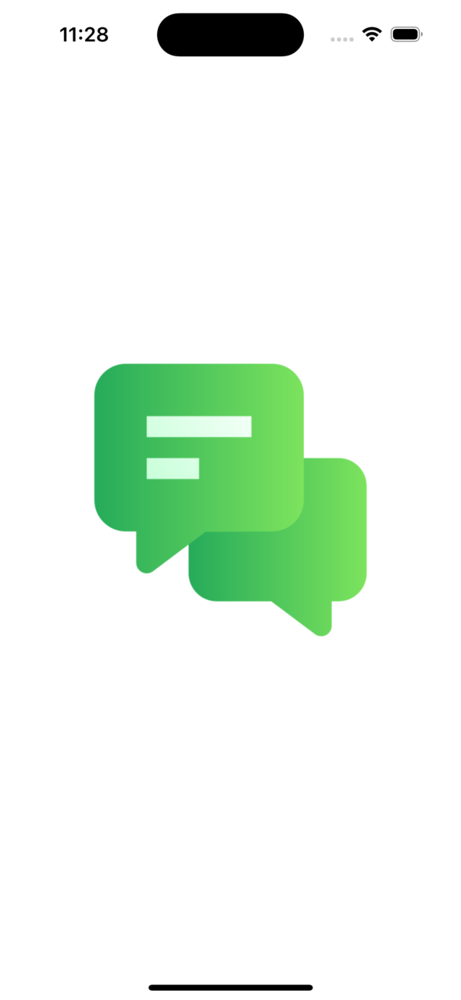
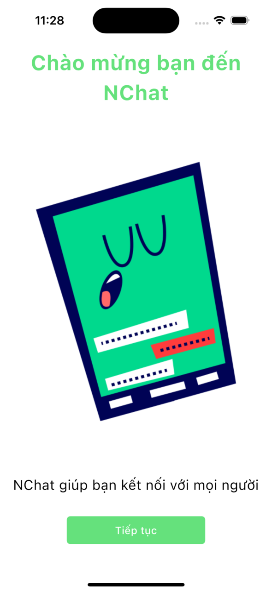
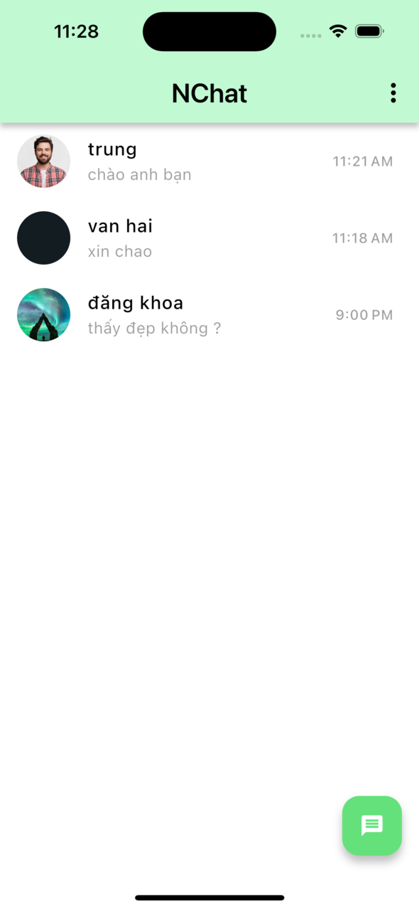
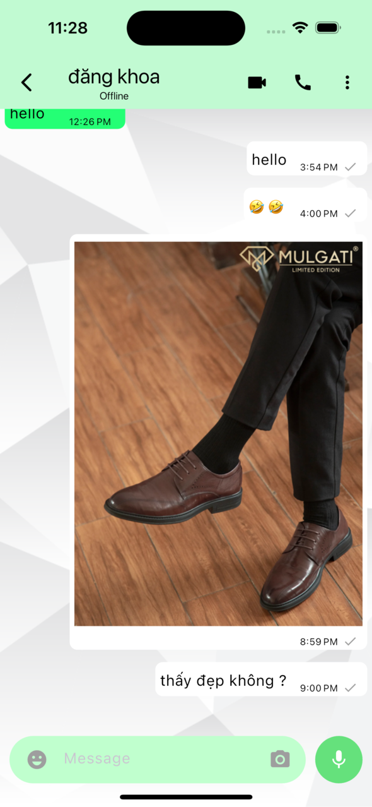

# NChat

NChat a simple messaging app built with flutter and data stored in firebase

## Screenshots

| Splash Screen | Welcome Screen |
|--------------|---------|
|  |  |

| Home Screen | Chat Screen |
|-------------|-------------|
|  |  |

## Features of NChat
* User authentication (Login with phonenumber)
* update information
* Real-time chat
* send text, image, audio messages
* This project follows Clean Architecture
* BLoC for state management
* some other features are under development
